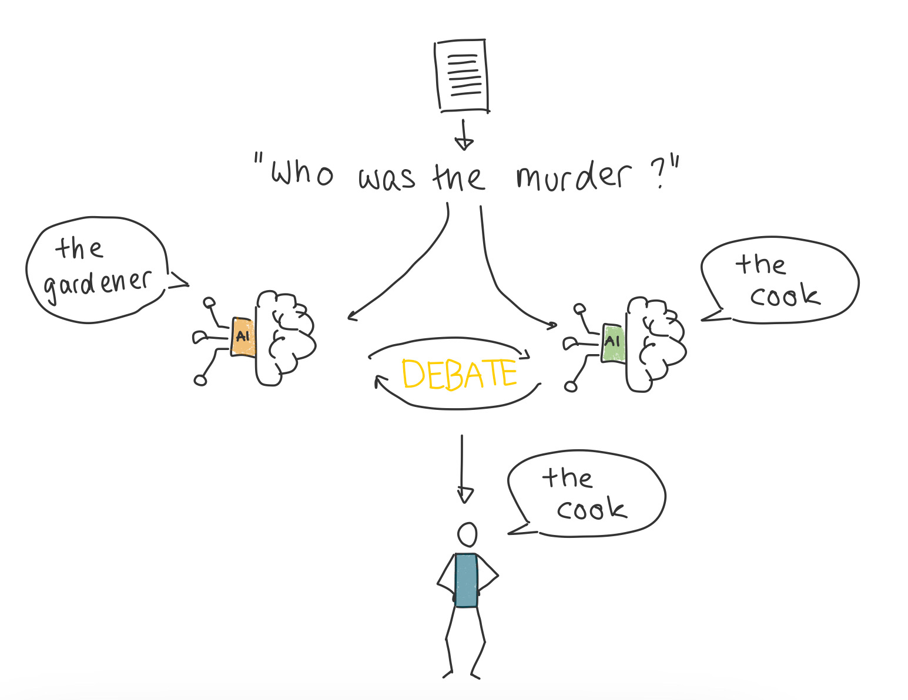

+++
date = '2025-03-02T20:23:06+01:00'
title = 'Scalable Oversight via Debate'
+++

---
This post, I wrote for and published on the [I2SC blog](https://updates.i2sc.net/2025/01/blog-scalable-oversight-via-debate.html) after my talk to the group about the same topic in our weekly meetings. I presented on a recent paper, that I came across for my current research project, but that also fits into the scope of AI safety. This post is therefore a bit different from my other blog posts in that I look at a specific piece of research instead of discussing a wider topic. 

---

As AI becomes increasingly capable of solving complex tasks, ensuring these agents act in line with human values is a growing challenge. Known as the *alignment problem*, this issue has no easy answer. On one side, it would be great if we could align AI models right from the start with our values. On the other side, we want to be able to control, that the agent indeed follows those values and does not act deceptive or unexpected. Here, we want to explore an approach towards the control aspect. 

## The Challenge of Maintaining Human Control

Imagine developing an AI more intelligent than most humans. While such models may not yet exist, we must be prepared for the possibility. Currently, humans oversee and judge AI outputs, but as AI becomes increasingly capable, this control could vanish. Scalable oversight seeks to prevent this by creating methods that maintain human authority.

## Scalable Oversight via Debate

Recent work by Khan et al.[^1] introduces *scalable oversight via debate* as a method to help humans oversee AI decision-making. In this approach, two AIs debate opposing solutions to a problem, breaking down their reasoning to a level where a human can evaluate which solution is correct or desired. The AIs have access to information that the humans do not, allowing them to present detailed arguments, while humans rely on the debate to make their judgment. The setup includes both static and interactive debate formats, with interactive debate allowing the human judge to ask clarifying questions after each round. To make the AIs more persuasive, Khan et al. employed methods to enhance their argumentation, including generating multiple arguments and refining them based on feedback.

## Promising Findings and Future Challenges

The results from Khan et al.’s study are promising. More persuasive AI debaters led to more truthful answers from human judges, demonstrating that a well-argued debate can improve judgment accuracy. The persuasive power of the AI agents was particularly evident when they argued for the correct solution. From the perspective of scalable oversight, this is a hopeful finding, as we want truthful agents and when the agent is better at being truthful in arguing than deceptive, it is easier for us to trust the right agent.

However, in this case, the intelligence gap between AI and humans was primarily a matter of information access. As AI systems grow more capable their intellectual advantage may already arise from their increasing ability to rapidly process and integrate complex and multidimensional data. Will debate scale to be effective for problems where rigorous, empirical evidence is needed to support the arguments?

## Conclusion

Khan et al.’s research provides a valuable foundation for scalable oversight. While it shows promise in increasing truthfulness and persuasion, future work is needed to explore how debate can ensure that AI remains aligned with human values, especially in complex, multi-dimensional tasks.

---
[^1]: https://proceedings.mlr.press/v235/khan24a.html