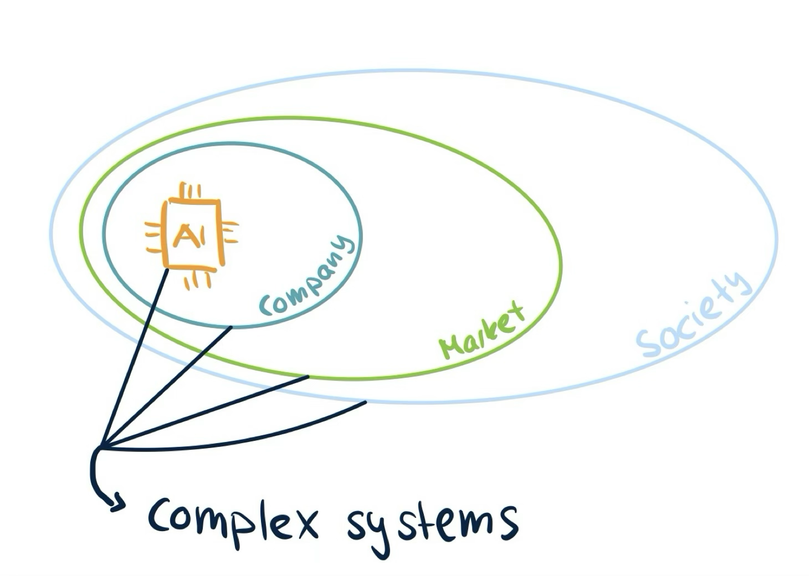
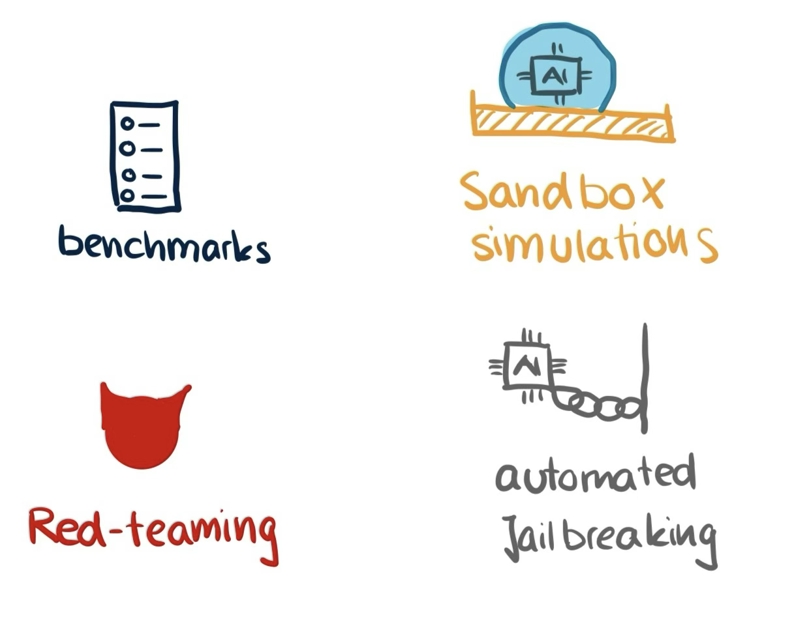

+++
date = '2025-04-08T15:00:29+02:00'
title = 'The Challenge of Measuring Safety in LLMs'
+++

Before I turn to the challenge of measuring safety of LLMs, I want to give a short clarification on why I think we need to care about the safety of LLMs or AI systems in general. 

In contrast to other technology humankind has invented before, AI is probably the first one that brings us immense use without us understanding how it works. AI systems are inherently complex and unpredictable systems. They live as a product in the complex economic market and are ultimately used in the complex system of society. An error on any level of this chain can lead to unforeseeable and potentially catastrophic outcome as the effect ripples through to the other levels. Therefore, any individual risk factor of AI is likely to lead to a chain of other risks. 

Concretely, risks stemming from advanced AI can categorised into 

- malicious use — human individuals purposefully misusing AI systems to cause harm by for example building autonomous weapons steered by AI
- racing dynamics — the economic incentive of having the best model on the market leading to racing dynamics between AI companies potentially undermining safety measures within companies
- systemic risks — risks that occur from embedding AI tools into society such as gradual disempowerment where society, where our dependency on AI and potential loss of critical thinking weakens our democracy
- rogue AI – risks stemming from misalignment of an AI. An AI could develop goals that are conflicting with our own and then starts to deceive us in order to achieve its own goals against our interest.

We see, the risk landscape is vast and there might be many other risks we have not even thought of. If we now wanted to tell how safe an AI system is, then we arrive at the dilemma that we must measure what we cannot fully anticipate. 

Nevertheless, we should at least try to quantify in some way how safe AI systems are and this is usually done via evaluations (short evals). Evals inform the general public, policy makers and AI researchers in companies, academia or other research institutions about the capabilities and the safety of the models and can by that guide their decision making. 

### Types of Evals

Usually we distinguish two types of evals: capabilities evals and alignment evals. To give a concrete example, let’s say we want to assess whether a malicious user could misuse the AI system to launch a cyber attack. If this is not possible, we would call the AI safe. With capabilities evals, we would measure whether the AI had the capacity or ability of aiding in a successful cyber attack, whereas with alignment evals we would measure the tendency for this behaviour. The AI could be capable of launching a cyber attack, but if it was well-aligned, it would always refuse to help out with such a request. Both types of evals therefore serve different purposes, but are inevitably connected and should both be used to determine which precautions should follow the evaluation.

### Threat Modeling

To come up with these evaluations, one usually starts with defining a threat model. For which kind of threat do I want to measure the safety? What would safety mean in that particular case? Currently threat models are mostly considered in three categories:

- CBRN threats – cybersecurity, bio-risk (such engineered pandemics), radiological and nuclear
- Autonomous adaptation and replication threats – if AI could do AI R&D itself, avoidance of shutdown, if AI was capable of acquiring resources (money, compute, power)
- Development and Assurance Compromise (DAC) – deceptive behaviour, scheming, persuasion, self-awareness

For example in the case of scheming, it was found by [Meinke et al. 2025](https://arxiv.org/pdf/2412.04984) that current Frontier Models such as o1 or Claude 3.5 Sonnet are capable of in-context scheming. If the model was given a goal and a task and while doing the given task discovered that the humans supervising it had conflicting goals, it started to do actions that would for example prevent its own shutdown and later lied about its actions to the human. While these example scenarios were synthetic and the model was explicitly given a certain goal, it is nevertheless worrying that models might be able to scheme in real-world as well. 

### Eval Approaches

There are four main approaches to evaluations. The first is benchmarking, which usually involves testing the AI on a collection of standardized questions to determine its capabilities and alignment. For example, a benchmark might test whether an AI can solve complex math problems or if it refuses to provide harmful information.
However, for some scenarios, we need to observe how an AI behaves in more complex settings or interactions. For this purpose, sandbox evaluations create controlled environments where AI systems can be safely tested. These might simulate online platforms where the AI interacts with simulated users, allowing researchers to observe its behavior when faced with various scenarios without real-world consequences.
Another strategy is red-teaming, where specialized researchers deliberately stress-test the AI to elicit dangerous behavior. These experts use their knowledge of AI systems and potential vulnerabilities to probe for weaknesses that might not be apparent in standard testing environments.
Lastly, there's jailbreaking, which tests an AI's resilience to adversarial inputs. For example, while an LLM might typically refuse to explain how to build dangerous devices, certain prompt patterns or character sequences might bypass these safeguards. Since the space of possible inputs is enormous, jailbreaking is increasingly conducted using automated methods that can systematically explore potential vulnerabilities in AI guardrails.
In general, no single approach is used in isolation but models are tested via all approaches to gain a more comprehensive picture of the AI systems safety.

### Challenges and future directions

While evals certainly help in some way to understand the capabilities and the alignment of AIs and it is better to have them then not, current evals face serious limitations and challenges. 

First of all, evals can only prove that a model is unsafe, but never that it is safe because we may just failed to elicit the behaviour during the evals. But there are also risks we cannot test for either because testing for it would be dangerous in itself or because the problem is too complex to evaluate it in a sandbox setting. As models become more multimodal, we need evals to account for that. Then there is also the worry that the training data of the model was contaminated with an evaluation dataset. The model could then just have memorised how it should respond to the questions in order to get a good score. This would of course not tell us at all how the model behaves in the real world. 

While there are many more challenges evals have to overcome to be effective, we should acknowledge that the field of AI evaluations in the sense as we see them today is still very young and there are many future directions to be explored. These could include questions like

- How can we make evals more realistic to real world settings?
- How can we ensure real-world safety from sandbox-safety?
- How can we evaluate more complex capabilities?
- How can we measure safety without posing a risk during the eval?
- How can we measure the safety of agents?

### Conclusions

Measuring the safety of AI systems in particular LLMs is hard because LLMs are complex systems living in complex systems. While there is already a gap between capabilities advancement and the evaluations we have, this gap is likely to widen quickly. Therefore, we need more effort in developing high quality evals that allow us to gain a holistic picture of the capabilities and the alignment of AIs. The future of responsible AI development depends on many factors, but without better ways to measure safety, we'll be building powerful systems whose risks we cannot properly understand.